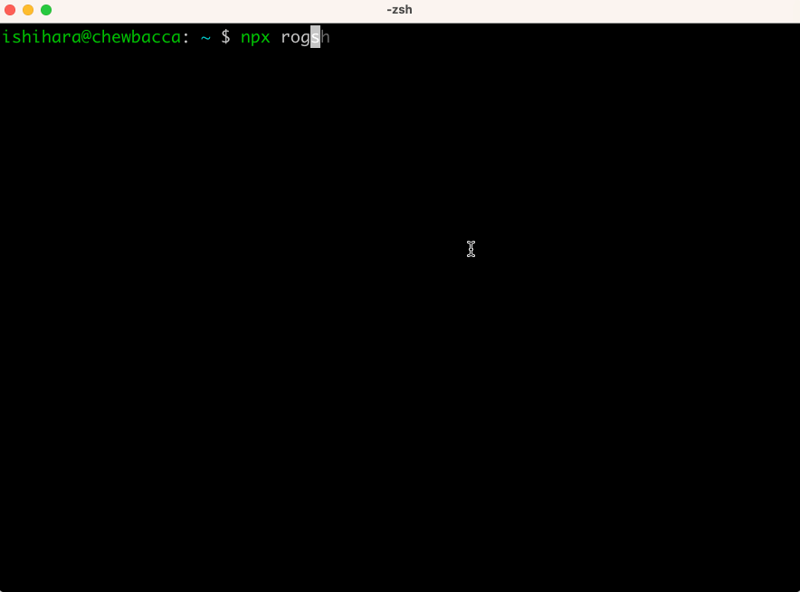

# rogsh

Unix command-line learning roguelike game

## Quick Start

**Play immediately without installation:**

```bash
npx rogsh
```

## Overview

rogsh is an educational roguelike game that teaches Unix command-line skills through an immersive cyberpunk adventure. Navigate a virtual filesystem as Agent-7, using real Unix commands to eliminate corrupted files and restore system stability.



## Features

- **Learn Unix commands** through hands-on gameplay
- **Immersive storyline** set in a cyberpunk future
- **Progressive tutorial** with guided hints
- **Multiple zones** with increasing complexity
- **Japanese and English** language support
- **No installation required** - play instantly with npx

## Installation (Optional)

If you prefer to install locally:

```bash
npm install -g rogsh
rogsh
```

## How to Play

### Basic Commands

- `ls` - List directory contents (use `ls -a` to show hidden files)
- `cd <dir>` - Change directory
- `pwd` - Print working directory
- `cat <file>` - Display file contents
- `rm <file>` - Remove files (eliminate threats)
- `help` - Show hints and available commands
- `exit` or `quit` - Exit the game

### Game Mechanics

- Use Unix commands to navigate the filesystem
- Find and eliminate corrupted files (shown in red)
- Follow the tutorial hints to progress through zones
- Explore thoroughly - some files are hidden
- Read README.txt files for important information

## Game Status Display

```
rogsh:[HP=100 EP=50 THR=3 /zone1]$
```

- **HP**: System Integrity (health)
- **EP**: Energy Points (remaining actions)
- **THR**: Threat Level (corruption intensity)
- **Path**: Current location in the filesystem

## Development

```bash
# Run tests
npm test

# Type checking
npm run typecheck

# Linting
npm run lint
```

## License

MIT
